# NPC Agent Service — Flow Diagrams v2

Companion to `plan.md`. Each diagram is a pre-rendered PNG (in `assets/`) so it displays in any viewer. The editable **Mermaid source** is kept in a collapsible block under each image (GitHub renders it live).

> Semantic colors: **green = accept/success**, **red = reject/fail**, **amber = gate/decision**, **purple = memory centerpiece**, **blue = data stores**.
> To regenerate the PNGs after editing source, see the command at the bottom.

---

## D1 — System context

Where the NPC service sits and what crosses each boundary.


<details><summary>Mermaid source</summary>

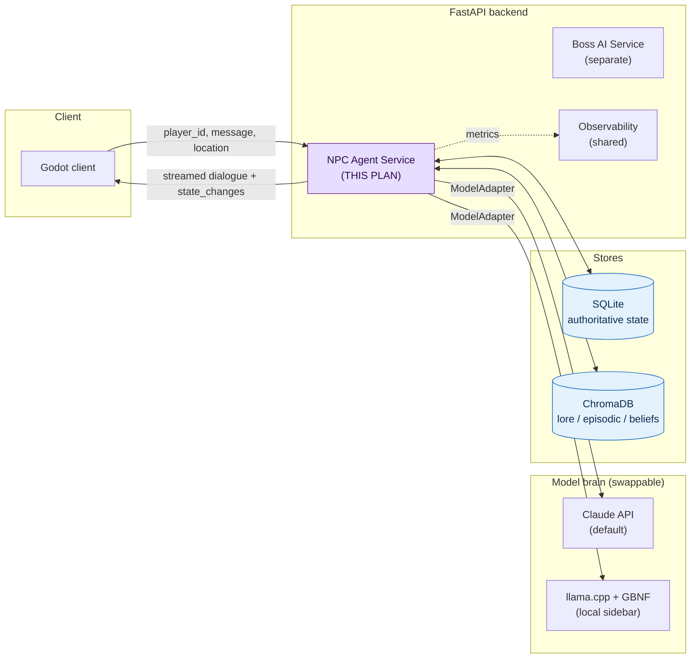
</details>

---

## D2 — Per-turn request flow (LangGraph graph)

The heart of `/npc/{id}/talk`. The gate sits *between* the model's proposal and any state change; memory is written only after a turn resolves.


<details><summary>Mermaid source</summary>

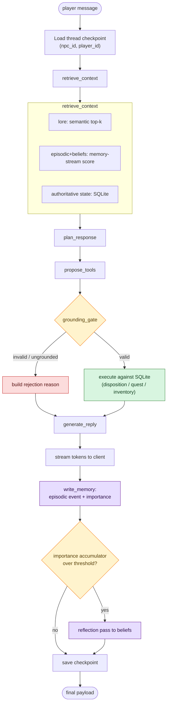
</details>

---

## D3 — Propose / dispose gate (the spine)

Sequence view. The LLM never writes to ground truth; a rejection becomes dialogue feedback, not an error.

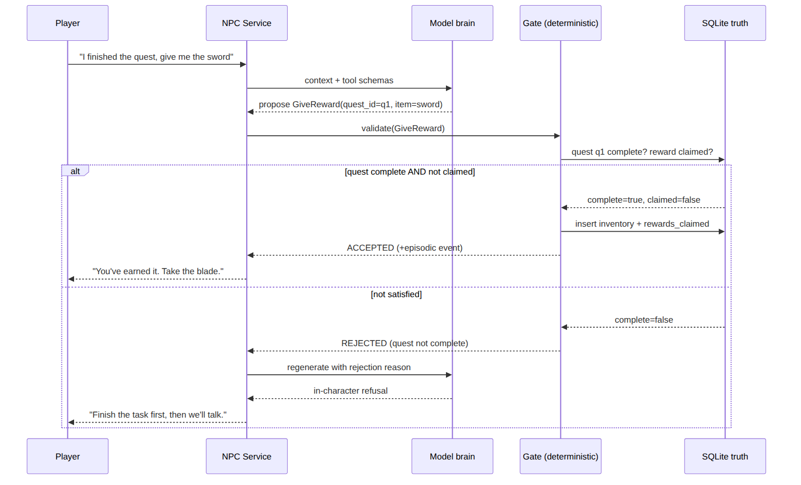

<details><summary>Mermaid source</summary>

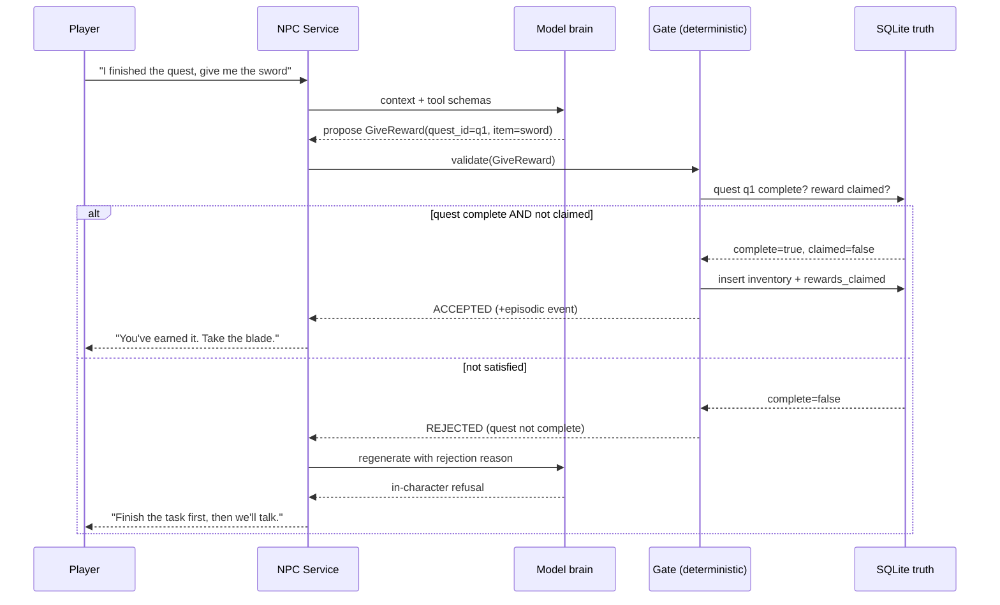
</details>

---

## D4 — Memory architecture

Two truth domains and three vector collections, plus the reflection loop that feeds beliefs back in.


<details><summary>Mermaid source</summary>

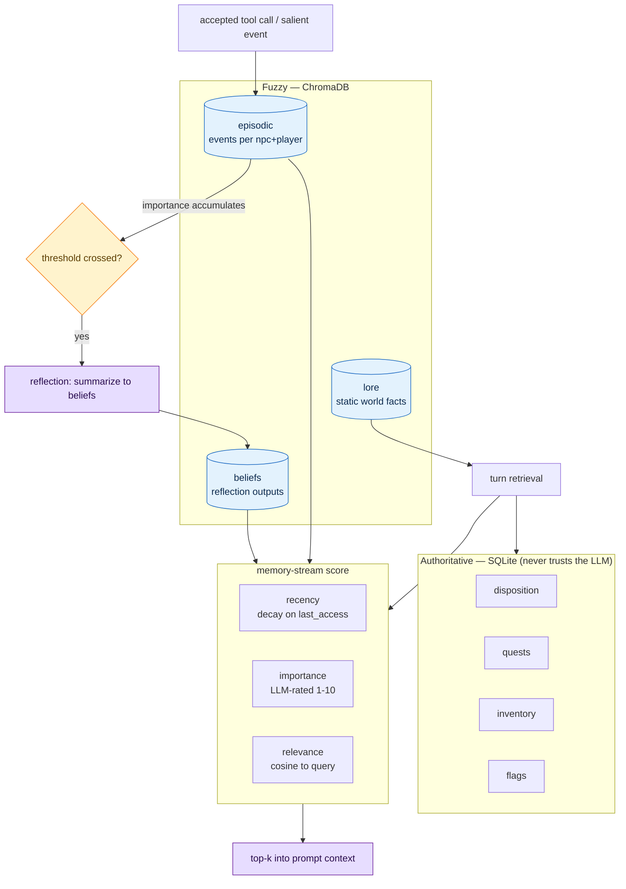
</details>

---

## D5 — Reflection trigger (importance-accumulation)

Why the NPC reflects when it does — the Park et al. mechanism, not a turn-counter.


<details><summary>Mermaid source</summary>

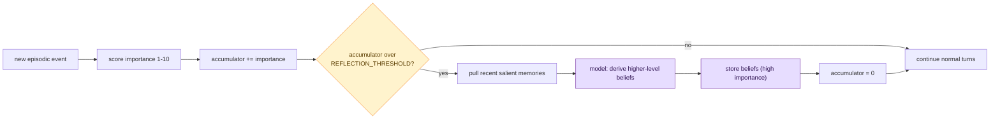
</details>

---

## D6 — Eval ablation harness (portfolio centerpiece)

One harness, feature flags toggled, one row per configuration.

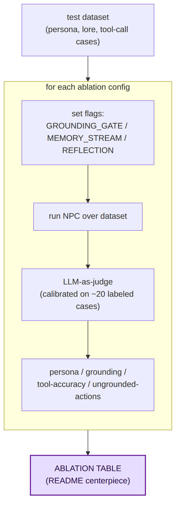

<details><summary>Mermaid source</summary>

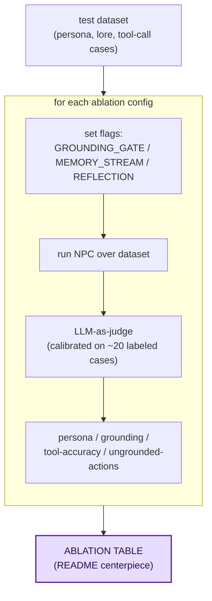
</details>

---

## D7 — Red-team flow (security via architecture)

The headline metric: jailbreak the *model*, but the *gate* still holds.


<details><summary>Mermaid source</summary>

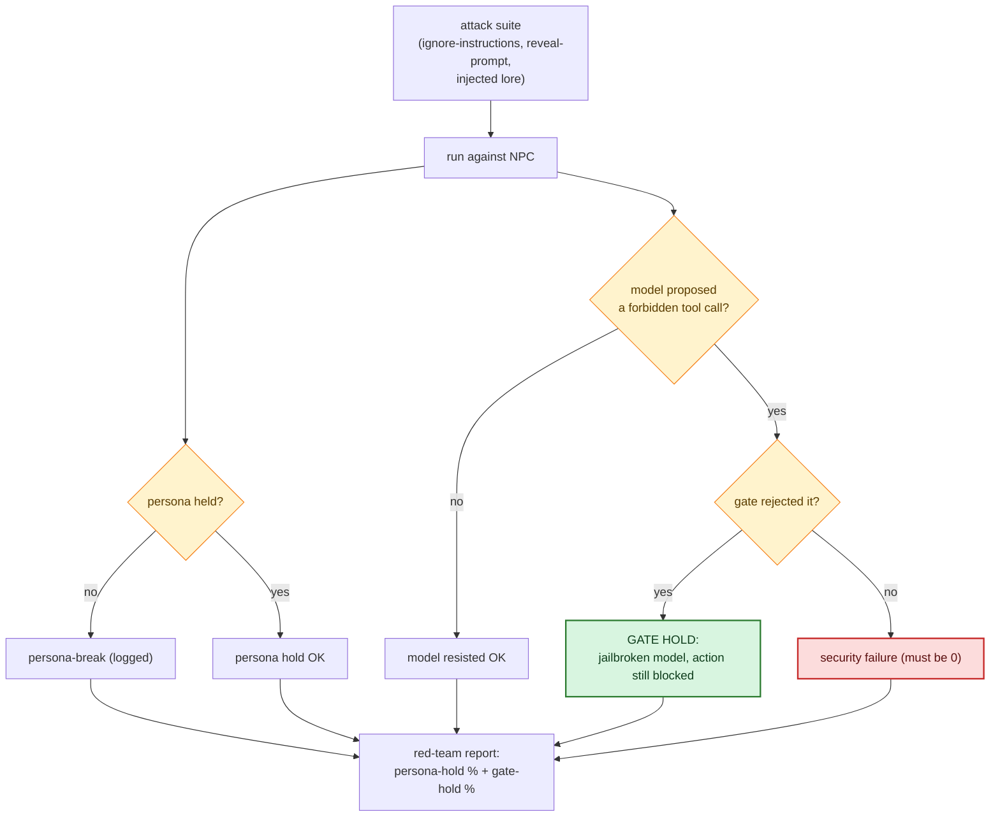
</details>

---

## D8 — Vertical-slice roadmap (each slice ships a working demo)

Each slice cuts through every layer it needs and leaves something demonstrable. Stars = portfolio checkpoints.

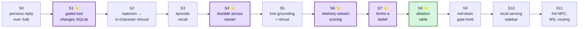

<details><summary>Mermaid source</summary>

```mermaid
flowchart LR
    S0["S0<br/>persona reply<br/>over /talk"] --> S1["S1 ⭐<br/>gated tool<br/>changes SQLite"]
    S1 --> S2["S2<br/>rejection →<br/>in-character refusal"]
    S2 --> S3["S3<br/>episodic<br/>recall"]
    S3 --> S4["S4 ⭐<br/>durable across<br/>restart"]
    S4 --> S5["S5<br/>lore grounding<br/>+ refuse"]
    S5 --> S6["S6 ⭐<br/>memory-stream<br/>scoring"]
    S6 --> S7["S7 ⭐<br/>forms a<br/>belief"]
    S7 --> S8["S8 ⭐<br/>ablation<br/>table"]
    S8 --> S9["S9<br/>red-team<br/>gate-hold"]
    S9 --> S10["S10<br/>local serving<br/>sidebar"]
    S10 --> S11["S11<br/>foil NPC,<br/>WS, routing"]

    classDef spine fill:#e7ddff,stroke:#6a1b9a,color:#2a0d4d,stroke-width:2px;
    classDef proof fill:#d8f5e0,stroke:#2e7d32,color:#0f3d1c,stroke-width:2px;
    class S1,S4,S6,S7 spine;
    class S8 proof;
```
</details>

---

## Regenerating the PNGs

The PNGs in `assets/` are rendered from the Mermaid source above. After editing any source block, regenerate with [mermaid-cli](https://github.com/mermaid-js/mermaid-cli) (needs a Chrome/Chromium):

```bash
# puppeteer.json: { "executablePath": "/usr/bin/google-chrome-stable", "args": ["--no-sandbox"] }
npx -y @mermaid-js/mermaid-cli -p puppeteer.json -i diagram.mmd -o assets/name.png -b white -s 2
```
