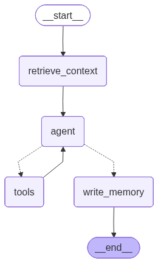
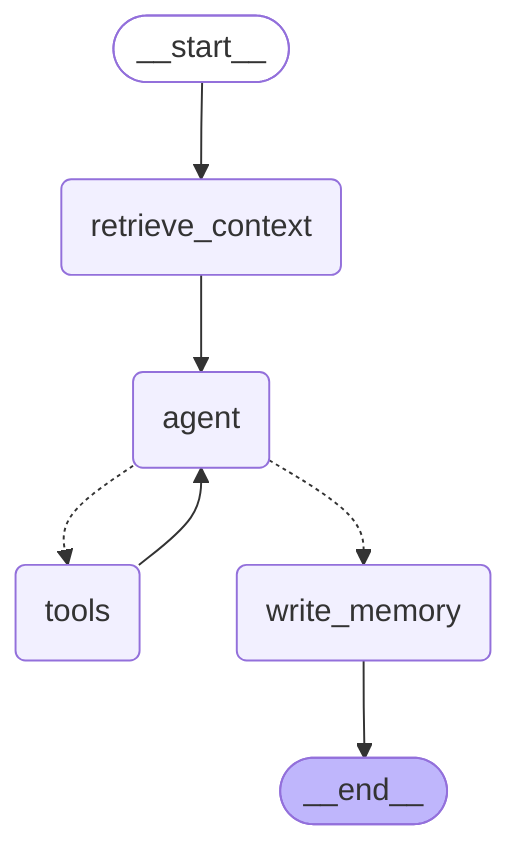

# Turn graph — current flow

Rendered from the compiled LangGraph (`backend/app/graph/build.py`). This is the **unified-agent**
shape ([ADR-0009](../../decisions/0009-unified-agent-turn.md), supersedes ADR-0007).

> **Keep this in sync.** It is checked in so the graph is diffable across versions. Whenever the
> topology changes, regenerate it (see *Regenerate* below) and commit the new Mermaid.

## Diagram

Rendered image (always displays, even where Mermaid isn't supported):



<details>
<summary>Mermaid source (editable / diffable)</summary>

> The LangGraph exporter prepends a `--- config: ... ---` frontmatter block that some Mermaid
> renderers (VS Code preview, older mermaid) fail on — it's **stripped here** so this block renders
> inline. The `s4_graph.png` above is the reliable visual; regenerate both when the graph changes.



</details>

## Nodes & edges

| Node | Role |
|------|------|
| `retrieve_context` | Reset per-turn scratch; read disposition (SQLite, read-only) + recall episodic memories (Chroma). Best-effort — degrades, never 500s. |
| `agent` | **Single persona+tools ReAct agent.** Streams (persona-tagged). If the turn carries tool calls → `tools`; otherwise its content **is** the in-character reply. The iteration cap lives *inside* this node (overflow turn drops tools → forced reply), so it doesn't appear as an edge. |
| `tools` | **Gate** (`gates.validate`) — the only writer of SQLite truth. Each verdict returns as a `ToolMessage` the agent re-reasons over (rejections explained in character). |
| `write_memory` | Persist episodic events after the reply (exception-guarded). |

- **Solid edges** are unconditional. **Dotted edges from `agent`** are the conditional route
  (`route_after_agent`): `tool_calls` present → `tools`, else → `write_memory`.
- `tools → agent` is the loop; the cap (`MAX_AGENT_TURNS`) + `recursion_limit=25` bound it.
- Not shown: the `AsyncSqliteSaver` checkpointer (durable `history` per `(npc_id, player_id)`) and
  token streaming via `astream_events` — both are orchestration around this graph, not nodes.

## Regenerate

When the graph topology changes, regenerate **both** the PNG and the inline source. From `backend/`:

```bash
# 1. Re-export the PNG into this folder (needs network — uses mermaid.ink)
PYTHONPATH=. .venv/bin/python -c "import app.graph.build as b; \
open('../docs/npc-agent-service/v2/assets/s4-turn-graph.png','wb').write(b.build_graph(None).get_graph().draw_mermaid_png())"

# 2. Re-emit the Mermaid source (frontmatter stripped) and paste it into the block above
PYTHONPATH=. .venv/bin/python -c "import re, app.graph.build as b; \
m=b.build_graph(None).get_graph().draw_mermaid(); \
print(re.sub(r'^---\nconfig:.*?\n---\n','',m,flags=re.DOTALL))"
```
